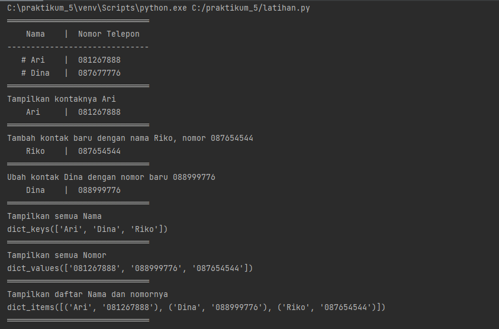
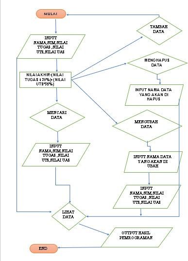
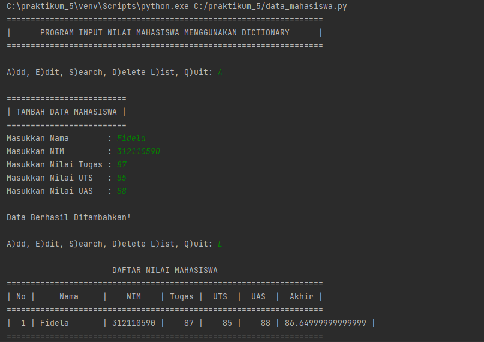

# Lab5
## Latihan 1
* Berikut ini adalah source code program latihan 1

```python
#Dictionary

daftarKontak = {"Nama":"Nomer Telpon"}
kontak       = {'Ari':'081267888', 'Dina' : '087677776'}

#print
print(30*"═")
print("    Nama    |  Nomor Telepon  ") #print daftarkontak
print(30*"-")
print("   # Ari    | ", kontak['Ari']) #print kontak Ari
print("   # Dina   | ", kontak['Dina']) #print kontak Dina
print(30*"═")

#Tampilkan kontaknya Ari
print("Tampilkan kontaknya Ari")
print("    Ari     | ", kontak['Ari']) #print kontak Ari
print(30*"═")
#Tambah kontak baru dengan nama Riko, nomor 087654544
print("Tambah kontak baru dengan nama Riko, nomor 087654544")
kontak['Riko'] = '087654544'
print("    Riko    | ", kontak['Riko'])
print(30*"═")

#Ubah kontak Dina dengan nomor baru 088999776
print("Ubah kontak Dina dengan nomor baru 088999776")
kontak['Dina'] = '088999776'
print("    Dina    | ", kontak['Dina'])
print(30*"═")

#Tampilkan semua Nama
print("Tampilkan semua Nama")
print(kontak.keys())
print(30*"═")

#Tampilkan semua Nomor
print("Tampilkan semua Nomor")
print(kontak.values())
print(30*"═")

#Tampilkan daftar Nama dan nomornya
print("Tampilkan daftar Nama dan nomornya")
print(kontak.items())
print(30*"═")

#MengHapus kontak Dina
print("Hapus kontak Dina")
kontak.pop('Dina')
print(kontak.items())
print(30*"═")
```

* Berikut ini adalah hasil programnya



### Tugas Praktikum
<p> Dibawah ini adalah program sederhana untuk membuat daftar nilai mahasiswa dengan menggunakan dictionary, dan menampilkan pilihan menu tambah, ubah, cari, hapus, dan lihat

* Berikut ini adalah source code programnya

```python
dataMahasiswa = {}
print("==================================================================")
print("|      PROGRAM INPUT NILAI MAHASISWA MENGGUNAKAN DICTIONARY      |")
print("==================================================================")

while True:
    c = input("\nA)dd, E)dit, S)earch, D)elete L)ist, Q)uit: ")

    ## MENU ADD
    if (c.lower() == 'a'):
        print("\n=========================")
        print("| TAMBAH DATA MAHASISWA |")
        print("=========================")
        nama          = input("Masukkan Nama        : ")
        nim           = input("Masukkan NIM         : ")
        nilaiTugas    = int(input("Masukkan Nilai Tugas : "))
        nilaiUts      = int(input("Masukkan Nilai UTS   : "))
        nilaiUas      = int(input("Masukkan Nilai UAS   : "))
        nilaiAkhir    = (0.30 * nilaiTugas) + (0.35 * nilaiUts) + (0.35 * nilaiUas)
        dataMahasiswa[nama] = nim, nilaiTugas, nilaiUts, nilaiUas, nilaiAkhir
        print("\nData Berhasil Ditambahkan!")

    ## MENU EDIT
    elif (c.lower() == 'e'):
        print("\n=======================")
        print("| EDIT DATA MAHASISWA |")
        print("=======================")
        nama = input("Masukkan Nama: ")
        if nama in dataMahasiswa.keys():
            nim           = input("Masukkan NIM Baru         : ")
            nilaiTugas    = int(input("Masukkan Nilai Tugas Baru : "))
            nilaiUts      = int(input("Masukkan Nilai UTS Baru   : "))
            nilaiUas      = int(input("Masukkan Nilai UAS Baru   : "))
            nilaiAkhir    = (0.30 * nilaiTugas) + (0.35 * nilaiUts) + (0.35 * nilaiUas)
            dataMahasiswa[nama] = nim, nilaiTugas, nilaiUts, nilaiUas, nilaiAkhir
            print("\nData Berhasil Di Update!")
        else:
            print("Data tidak ditemukan!")

    ## MENU SEARCH
    elif (c.lower() == 's'):
        print("\n=======================")
        print("| CARI DATA MAHASISWA |")
        print("=======================")
        nama = input("Masukan Nama:  ")
        if nama in dataMahasiswa.keys():
            print("\n                   DAFTAR NILAI MAHASISWA                   ")
            print("==============================================================")
            print("|     Nama     |    NIM    | Tugas |  UTS  |  UAS  |  Akhir |")
            print("==============================================================")
            print("| {0:12s} | {1:9s} | {2:5} | {3:5} | {4:5} | {5:6} |".format(nama, nim, nilaiTugas, nilaiUts, nilaiUas, nilaiAkhir))
            print("==============================================================")
        else:
            print("Datanya {0} Tidak Ada ".format(nama))

    ## MENU DELETE
    elif (c.lower() == 'd'):
        nama = input("Masukkan Nama:  ")
        if nama in dataMahasiswa.keys():
            del dataMahasiswa[nama]
            print("Data Telah dihapus!")
        else:
            print("Data Mahasiswa Tidak Ada".format(nama))

    ## MENU LIST
    elif (c.lower() == 'l'):
        if dataMahasiswa.items():
            print("\n                      DAFTAR NILAI MAHASISWA                    ")
            print("==================================================================")
            print("| No |     Nama     |    NIM    | Tugas |  UTS  |  UAS  |  Akhir |")
            print("==================================================================")
            i = 0
            for x in dataMahasiswa.items():
                i += 1
                print("| {6:2} | {0:12s} | {1:9s} | {2:5} | {3:5} | {4:5} | {5:6} |".format(x[0], x[1][0], x[1][1], x[1][2], x[1][3], x[1][4], i))
            print("==================================================================")
        else:
            print("\n                      DAFTAR NILAI MAHASISWA                    ")
            print("==================================================================")
            print("| No |     Nama     |    NIM    | Tugas |  UTS  |  UAS  |  Akhir |")
            print("==================================================================")
            print("|                          TIDAK ADA DATA!                       |")
            print("==================================================================")

    ## MENU KELUAR PROGRAM
    elif (c.lower() == 'q'):
        print("\n Fidela \n 312110590 \n TI.21.A.2")
        break

    else:
        print("Pilih menu yang tersedia: ")
```
* Berikut ini adalah flowchartnya



* Dengan penjelasan source code sebagai berikut:

```python
dataMahasiswa = {} 
```
-Diatas adalah dictionary yang di definisikan terlebih dahulu.


```python
-while True:
``` 
-Diatas adalah perulangan yang digunakan.


```python
while True:
    c = input("\nA)dd, E)dit, S)earch, D)elete L)ist, Q)uit: ")
```
-keluar
* Perulangan di atas adalah perulangan yang akan berjalan terus menerus, dan akan berhenti jika kode berikut di eksekusi.
```python
if (c.lower() == 'q'):
```    
* Jika q di input dan lower() digunakan untuk mengkonversi input yang dimasukan ke bentuk lower case dan Input q digunakan berdasarkan perintah yang sudah di masukan dalam keterangan pada fungsi input di bawah ini :   

```python
elif (c.lower() == 'q'):
        print("\n Fidela \n 312110590 \n TI.21.A.2")
        break
    else:
        print("Pilih menu yang tersedia: ") 
```
-Input data
* berikut kode yang digunakan untuk melakukan input data seperti Nama, NIM, Nilai Tugas, UTS dan UAS :    

```python
elif (c.lower() == 'e'):
       print("\n=======================")
       print("| EDIT DATA MAHASISWA |  ")
       print("=======================  ")
       nama = input("Masukkan Nama: ")
       if nama in dataMahasiswa.keys():
           nim           = input("Masukkan NIM Baru         : ")
           nilaiTugas    = int(input("Masukkan Nilai Tugas Baru : "))
           nilaiUts      = int(input("Masukkan Nilai UTS Baru   : "))
           nilaiUas      = int(input("Masukkan Nilai UAS Baru   : "))
           nilaiAkhir    = (0.30 * nilaiTugas) + (0.35 * nilaiUts) + (0.35 * nilaiUas)
           dataMahasiswa[nama] = nim, nilaiTugas, nilaiUts, nilaiUas, nilaiAkhir
           print("\nData Berhasil Di Update!")
       else:
           print("Data tidak ditemukan!")    
```
-Melihat data
* Selanjutnya adalah kode yang digunakan untuk melihat input yang sudah dimasukan.

```python
* Data dalam perulangan for di ambil dari variabel dictionary dataMahasiswa pada bagian value yang berbentuk list. variabel i diguanakan untuk membuat nomor. Data yang akan ditampilkan adalah Nama, NIM,Tugas, UTS, UAS, dan Nilai Akhir.
```
```python
elif (c.lower() == 'l'):
        if dataMahasiswa.items():
            print("\n                      DAFTAR NILAI MAHASISWA                    ")
            print("==================================================================")
            print("| No |     Nama     |    NIM    | Tugas |  UTS  |  UAS  |  Akhir |")
            print("==================================================================")
            i = 0
            for x in dataMahasiswa.items():
                i += 1
                print("| {6:2} | {0:12s} | {1:9s} | {2:5} | {3:5} | {4:5} | {5:6} |".format(x[0], x[1][0], x[1][1], x[1][2], x[1][3], x[1][4], i))
            print("==================================================================")
        else:
            print("\n                      DAFTAR NILAI MAHASISWA                    ")
            print("==================================================================")
            print("| No |     Nama     |    NIM    | Tugas |  UTS  |  UAS  |  Akhir |")
            print("==================================================================")
            print("|                          TIDAK ADA DATA!                       |")
            print("==================================================================")
```
-Mengubah data

```python
* Perintah dijalankan jika input yang di masukan adalah E, di dalam kondisi ini terdapat input dan kondisi, dimana jika input nama ada di dalam variabel dataMahasiswa maka akan muncul beberapa pilihan untuk mengubah semua data atau data tertentu saja.
```

```python
elif (c.lower() == 'e'):
        print("\n=======================")
        print("| EDIT DATA MAHASISWA |")
        print("=======================")
        nama = input("Masukkan Nama: ")
        if nama in dataMahasiswa.keys():
            nim           = input("Masukkan NIM Baru         : ")
            nilaiTugas    = int(input("Masukkan Nilai Tugas Baru : "))
            nilaiUts      = int(input("Masukkan Nilai UTS Baru   : "))
            nilaiUas      = int(input("Masukkan Nilai UAS Baru   : "))
            nilaiAkhir    = (0.30 * nilaiTugas) + (0.35 * nilaiUts) + (0.35 * nilaiUas)
            dataMahasiswa[nama] = nim, nilaiTugas, nilaiUts, nilaiUas, nilaiAkhir
            print("\nData Berhasil Di Update!")
        else:
            print("Data tidak ditemukan!")
```

-Mencari Data
* Perbandingan untuk mencari data yang akan diubah sama seperti cara mengubah data, hanya saja perintah ini digunakan untuk menampilkan data yang di input berdasarkan nama. berikut kode yang digunakan

```python
elif (c.lower() == 's'):
        print("\n=======================")
        print("| CARI DATA MAHASISWA |")
        print("=======================")
        nama = input("Masukan Nama:  ")
        if nama in dataMahasiswa.keys():
            print("\n                   DAFTAR NILAI MAHASISWA                   ")
            print("==============================================================")
            print("|     Nama     |    NIM    | Tugas |  UTS  |  UAS  |  Akhir |")
            print("==============================================================")
            print("| {0:12s} | {1:9s} | {2:5} | {3:5} | {4:5} | {5:6} |".format(nama, nim, nilaiTugas, nilaiUts, nilaiUas, nilaiAkhir))
            print("==============================================================")
        else:
            print("Datanya {0} Tidak Ada ".format(nama))
```
-Menghapus data
* Sama seperti mengubah dan mencari data, untuk menghapus data yang dipilih.

```python
* Data yang di hapus adalah data yang di input dalam variabel nama dimana berisi nama (string) yang mewakili data NIM, Nilai Tugas, UTS dan UAS.
```

```python
elif (c.lower() == 'd'):
        nama = input("Masukkan Nama:  ")
        if nama in dataMahasiswa.keys():
            del dataMahasiswa[nama]
            print("Data Telah dihapus!")
        else:
            print("Data Mahasiswa Tidak Ada".format(nama))
```
### Berikut ini adalah hasil programnya



### Sekian dan terima kasih


